# 🧠 PolicyMind v2.0

<div align="center">


**AI-Powered Insurance Policy Analysis Engine with Natural Language Processing**

[](https://python.org)
[](https://fastapi.tiangolo.com)
[](https://streamlit.io)
[](https://ollama.ai)
[](LICENSE)

[🚀 Quick Start](#-quick-start) • [📚 Documentation](#-documentation) • [🎯 Features](#-features) • [🛠 Installation](#-installation) • [💡 Examples](#-examples)

</div>

---

## 🌟 What is PolicyMind?

PolicyMind is a cutting-edge AI system that transforms complex insurance policy documents into instant, human-readable answers. Simply upload your policy PDF and ask questions in plain English to get immediate coverage decisions with detailed explanations.

### ✨ Key Highlights

- 🤖 **AI-Powered Analysis**: Uses Microsoft's Phi-3 model for intelligent decision making
- 💬 **Natural Language Interface**: Ask questions like "Can my 45-year-old patient get knee surgery covered?"
- ⚡ **Instant Results**: Get coverage decisions in under 3 seconds
- 📊 **Detailed Insights**: Understand the reasoning behind every decision
- 🔍 **Smart Document Processing**: Automatically extracts and indexes policy clauses
- 📱 **Beautiful Web Interface**: Intuitive Streamlit dashboard with real-time analysis

---

## 🎯 Features

### 🧠 Intelligent Analysis Engine
- **Advanced NLP Processing** with sentence transformers
- **Vector-based similarity search** using FAISS indexing
- **Multi-factor decision logic** considering age, procedure, waiting periods
- **Confidence scoring** for decision reliability

### 💬 Natural Language Interface
- **Plain English queries** - no technical jargon needed
- **Context-aware responses** with next-step recommendations
- **Multi-language support** for diverse user bases
- **Smart query parsing** to extract key information

### 📊 Comprehensive Analytics
- **Real-time decision confidence** with visual indicators
- **Historical query tracking** and success rate analysis
- **Detailed justification** for every coverage decision
- **Export functionality** for record keeping

### 🔒 Enterprise-Ready
- **Secure document processing** with privacy protection
- **Scalable architecture** using FastAPI backend
- **RESTful API** for system integration
- **Offline capability** with local AI models

---

## 🛠 Installation

### Prerequisites
```bash
Python 3.8+
Ollama (for Phi-3 model)
4GB+ RAM (8GB recommended)
```

### 1. Clone the Repository
```bash
git clone https://github.com/yourusername/policymind.git
cd policymind
```

### 2. Install Dependencies
```bash
pip install -r requirements.txt
```

### 3. Set Up Ollama and Phi-3
```bash
# Install Ollama
curl -fsSL https://ollama.ai/install.sh | sh

# Pull Phi-3 model
ollama pull phi3:latest
```

### 4. Initialize the System
```bash
# Create necessary directories
mkdir -p data/uploaded_docs
mkdir -p data

# Build search index (optional - will be built on first document upload)
python scripts/build_index.py
```

---

## 🚀 Quick Start

### 1. Start the Backend Server
```bash
uvicorn backend.main:app --reload --host 0.0.0.0 --port 8000
```

### 2. Launch the Web Interface
```bash
streamlit run streamlit_app.py
```

### 3. Access PolicyMind
Open your browser and navigate to `http://localhost:8501`

### 4. Upload & Analyze
1. **Upload your insurance policy PDF**
2. **Ask questions like:**
   - "46-year-old male, knee surgery in Mumbai, 3-month policy"
   - "Cataract surgery for 65-year-old woman, 2-year policy"
   - "Emergency appendectomy, 25-year-old, 1-week-old policy"
3. **Get instant AI-powered analysis!**

---

## 💡 Usage Examples

### Example 1: Standard Coverage Query
```
Query: "45-year-old female, gallbladder surgery, 18-month policy"

AI Response:
✅ Good news! Your gallbladder surgery is covered under your policy. 
Coverage amount: Up to Sum Insured. Since your policy has been active 
for 18 months, the waiting period requirements have been met.

Next steps: You can proceed with your treatment. Keep all medical 
bills and documents for claim submission.
```

### Example 2: Waiting Period Issue
```
Query: "30-year-old male, hernia surgery, 2-week policy"

AI Response:
❌ Unfortunately, your hernia surgery claim cannot be approved at this time. 
Your policy has been active for only 0.5 months, but specified diseases 
like hernia require a 24-month waiting period.

Next steps: Contact customer service for more details or wait for the 
required waiting period to complete.
```

### Example 3: API Usage
```python
import requests

response = requests.post(
    "http://localhost:8000/query",
    json={"query": "55-year-old diabetic, cataract surgery, 3-year policy"}
)

result = response.json()
print(f"Decision: {result['decision']}")
print(f"Confidence: {result['confidence']:.1%}")
print(f"Response: {result['user_friendly_response']}")
```

---

## 🏗 Architecture

```mermaid
graph TB
    A[📱 Streamlit Frontend] --> B[🚀 FastAPI Backend]
    B --> C[📄 Document Processor]
    B --> D[🧠 LLM Engine]
    B --> E[🔍 Vector Store]
    
    C --> F[(📚 Parsed Documents)]
    E --> G[(🗂 FAISS Index)]
    D --> H[🤖 Phi-3 Model]
    
    I[📑 PDF Upload] --> C
    J[❓ User Query] --> K[🔄 Query Processor]
    K --> D
    K --> E
    
    L[✅ Decision Engine] --> M[💬 Response Generator]
    D --> L
    E --> L
```



### Core Components

| Component | Technology | Purpose |
|-----------|------------|---------|
| **Frontend** | Streamlit | Interactive web interface |
| **Backend** | FastAPI | RESTful API server |
| **Document Processing** | PyMuPDF | PDF parsing and text extraction |
| **AI Engine** | Phi-3 (Ollama) | Natural language understanding |
| **Vector Search** | FAISS + Sentence Transformers | Semantic document search |
| **Decision Logic** | Custom Python | Policy rule implementation |

---

## 📂 Project Structure

```
PolicyMind/
├── 📁 backend/
│   ├── 🐍 main.py              # FastAPI application
│   ├── 🔄 routes.py            # API endpoints
│   ├── 📄 document_processor.py # PDF parsing logic
│   ├── 🧠 llm.py               # AI model interface
│   ├── 🔍 vector_store.py      # FAISS search engine
│   └── ⚙️ pipeline.py          # Decision pipeline
├── 📁 scripts/
│   └── 🏗 build_index.py       # Index building utility
├── 📁 data/
│   ├── 📚 uploaded_docs/       # Uploaded PDFs
│   ├── 📊 parsed_output.json   # Processed documents
│   ├── 🗂 faiss.index          # Vector index
│   └── 📋 metadata.pkl         # Document metadata
├── 🎨 streamlit_app.py         # Web interface
├── 📋 requirements.txt         # Dependencies
└── 📖 README.md               # This file
```

---

## 🔧 Configuration

### Environment Variables
```bash
# Optional configurations
OLLAMA_HOST=http://localhost:11434
MODEL_NAME=phi3:latest
MAX_CHUNKS=5
CONFIDENCE_THRESHOLD=0.7
```

### Customizing the System

#### Adding New Models
```python
# In backend/llm.py
client = Client(host="http://localhost:11434")

# Change model
response = client.generate(
    model="your-model-name",  # Change this
    prompt=prompt,
    options=options
)
```

#### Adjusting Decision Logic
```python
# In backend/pipeline.py
def make_rule_based_decision(structured: dict) -> dict:
    duration = structured.get('policy_duration_months', 0)
    
    # Add your custom rules here
    if your_custom_condition:
        return {
            "decision": "approved",
            "confidence": 0.9,
            # ... rest of logic
        }
```

---

## 🚀 API Documentation

### Endpoints

#### POST `/upload/`
Upload and process insurance policy PDFs.

**Request:**
```bash
curl -X POST "http://localhost:8000/upload/" \
     -F "file=@policy.pdf"
```

**Response:**
```json
{
  "status": "success",
  "message": "Document processed and indexed."
}
```

#### POST `/query`
Analyze insurance coverage queries.

**Request:**
```bash
curl -X POST "http://localhost:8000/query" \
     -H "Content-Type: application/json" \
     -d '{"query": "45-year-old male, knee surgery, 3-month policy"}'
```

**Response:**
```json
{
  "decision": "approved",
  "amount": "Up to Sum Insured",
  "confidence": 0.92,
  "user_friendly_response": "✅ Good news! Your knee surgery is covered...",
  "justification": [...],
  "query_structured": {...}
}
```

---

## 🧪 Testing

### Run Basic Tests
```bash
# Test document processing
python -c "from backend.document_processor import save_and_process_pdf; print('✅ Document processor working')"

# Test LLM connection
python -c "from backend.llm import test_llm_json_extraction; test_llm_json_extraction()"

# Test vector search
python -c "from backend.vector_store import search_chunks; print('✅ Vector search working')"
```

### Sample Test Cases
```python
# Test various scenarios
test_queries = [
    "25-year-old, emergency surgery, 1-day policy",  # Should reject
    "50-year-old, routine checkup, 2-year policy",   # Should approve
    "70-year-old, heart surgery, 6-month policy",    # May need review
]
```

---

## 🤝 Contributing

We welcome contributions! Here's how you can help:

### 🐛 Bug Reports
- Use the issue tracker
- Include system information
- Provide reproduction steps

### 💡 Feature Requests
- Describe the use case
- Explain the expected behavior
- Consider implementation complexity

### 🔧 Code Contributions
1. Fork the repository
2. Create a feature branch
3. Make your changes
4. Add tests if applicable
5. Submit a pull request

### 📝 Documentation
- Improve existing docs
- Add usage examples
- Create tutorials

---

## 🔮 Roadmap

### v2.1 (Next Release)
- [ ] 🌐 Multi-language support
- [ ] 📱 Mobile-responsive design
- [ ] 🔗 API rate limiting
- [ ] 📊 Advanced analytics dashboard

### v3.0 (Future)
- [ ] 🧠 Support for multiple AI models
- [ ] 🔒 Enterprise authentication
- [ ] 📈 Machine learning insights
- [ ] 🌍 Cloud deployment options

---

## ❓ FAQ

### **Q: Can I use this with my own insurance policies?**
A: Yes! PolicyMind works with any insurance policy PDF. Simply upload your document and start asking questions.

### **Q: Is my data secure?**
A: Absolutely. All processing happens locally on your machine. No data is sent to external servers.

### **Q: What types of queries work best?**
A: Include age, procedure, policy duration, and location for best results. Example: "45-year-old male, knee surgery, 6-month policy in Mumbai"

### **Q: Can I integrate this with my existing system?**
A: Yes! Use the FastAPI backend to integrate PolicyMind into your applications via REST API.

### **Q: What languages are supported?**
A: Currently English, with multi-language support planned for v2.1.

---

## 📜 License

This project is licensed under the MIT License - see the [LICENSE](LICENSE) file for details.

---

## 🙏 Acknowledgments

- **Microsoft** for the Phi-3 model
- **Ollama** for local AI model serving
- **Streamlit** for the beautiful web interface
- **FastAPI** for the robust backend framework
- **FAISS** for efficient vector search
- **Sentence Transformers** for semantic embeddings

---

## 📞 Support

- 📧 **Email**: support@policymind.ai
- 💬 **Discord**: [Join our community](https://discord.gg/policymind)
- 📚 **Documentation**: [docs.policymind.ai](https://docs.policymind.ai)
- 🐛 **Issues**: [GitHub Issues](https://github.com/yourusername/policymind/issues)

---

<div align="center">

**Made with ❤️ by the PolicyMind Team**

⭐ **Star this repo if you find it helpful!** ⭐

[🚀 Get Started](#-quick-start) • [💬 Join Community](https://discord.gg/policymind) • [📖 Read Docs](https://docs.policymind.ai)

</div>